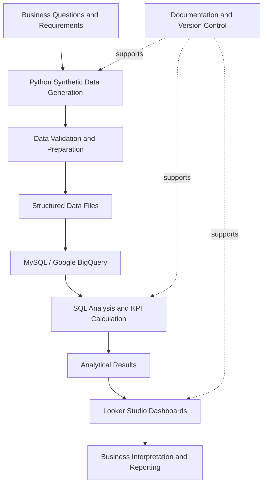

# StreamFlow Platform Analytics — Project Charter

**Project type:** Data Analytics and Business Intelligence  
**Organization:** StreamFlow (fictional subscription-based video-streaming company)  
**Document status:** Working charter  
**Version:** 1.0  
**Last updated:** 2 October 2026

---

## 1. Project Purpose

StreamFlow Platform Analytics is an end-to-end analytics project designed to demonstrate how operational data from a fictional subscription-based video-streaming business can be prepared, analyzed, and presented to support business understanding and decision-making.

The project brings together data generation, data validation, database and warehouse storage, SQL analysis, KPI development, and dashboard reporting. It focuses on five business domains: customer, revenue, content, marketing, and customer support analytics.

Because StreamFlow is fictional, the project uses synthetic data. The datasets represent example business scenarios and should not be interpreted as actual company performance.

## 2. Business Background

Subscription streaming businesses need to understand how customers subscribe and engage with content, how revenue changes over time, which marketing activities generate responses, and how effectively customer issues are handled.

These questions often require information from multiple operational areas. A structured analytics workflow can bring these data domains together and provide consistent metrics for exploration and reporting.

For the purposes of this project, StreamFlow's business context is represented through datasets covering customers, subscription plans, subscriptions, payments, content, viewing activity, marketing campaigns, campaign responses, and support tickets. Device and geographic attributes provide additional context where available.

## 3. Problem Statement

The project is intended to address the challenge of turning separate operational datasets into an organized and understandable view of business performance. Without consistent preparation, definitions, and reporting, it can be difficult to compare metrics across business domains or identify areas that warrant further investigation.

StreamFlow Platform Analytics establishes a repeatable workflow for preparing synthetic data, querying it with SQL, defining business metrics, and presenting the results through dashboards and documentation.

## 4. Project Objectives

The project objectives are to:

1. Generate synthetic datasets representing the main operational areas of a streaming platform.
2. Validate datasets for common quality issues such as missing values, duplicates, invalid values, and inconsistent relationships.
3. Store and organize data for relational and analytical querying using the database tools used in the project.
4. Develop SQL analyses for customer, revenue, content, marketing, and support performance.
5. Define and calculate relevant business KPIs with clear calculation logic and interpretation notes.
6. Present analytical results through an executive overview and domain-specific dashboards in Looker Studio.
7. Document the data, metrics, workflow, assumptions, and limitations so the project can be understood and reviewed by others.

## 5. Scope

### 5.1 In Scope

- Synthetic data generation using Python, Pandas, and NumPy.
- Data validation and preparation.
- Relational data storage and SQL work using MySQL where applicable.
- Cloud analytical storage and SQL querying using Google BigQuery.
- Documentation of dataset structures, column meanings, and proposed table relationships.
- SQL analysis across the five business domains.
- KPI calculations and trend, segment, and comparative analysis.
- Looker Studio dashboard development.
- Project documentation, including the README, data dictionary, project charter, architecture, and ER diagram.
- Version control using Git and GitHub.

### 5.2 Out of Scope

The following items are not part of the current project scope unless added through a later project revision:

- Analysis of real customer or commercially confidential streaming-platform data.
- Production deployment for an actual streaming company.
- Live ingestion from operational streaming systems.
- Automated production-grade orchestration and monitoring.
- Predictive machine learning models, such as churn prediction or content recommendation, as completed deliverables.
- Real-time campaign optimization or customer-level interventions.
- Financial reporting or revenue recognition intended for accounting or regulatory use.

## 6. Stakeholders and Intended Audience

As a portfolio project, StreamFlow does not have a real sponsoring organization or operational stakeholder group. The following roles describe the intended project perspective rather than named or formally appointed people.

| Role | Interest or responsibility |
|---|---|
| Project owner / analyst | Defines the scope, prepares the data, performs analysis, develops dashboards, and maintains documentation. |
| Business leadership (simulated audience) | Uses the executive overview to review high-level performance indicators. |
| Customer and subscription team (simulated audience) | Reviews customer profiles, subscription behavior, engagement, retention, and churn-related measures. |
| Finance team (simulated audience) | Reviews payment-based revenue trends and subscription-plan comparisons. |
| Content team (simulated audience) | Reviews watch time, viewing activity, content popularity, and genre performance. |
| Marketing team (simulated audience) | Reviews campaign responses, conversions, costs, and attributed performance measures. |
| Customer support team (simulated audience) | Reviews ticket volume, resolution patterns, issue categories, and satisfaction measures where available. |
| Portfolio reviewer / recruiter | Reviews the project for analytical reasoning, technical workflow, documentation, and communication. |

## 7. Key Deliverables

| Deliverable | Description | Acceptance criteria |
|---|---|---|
| Synthetic datasets | Structured data representing the project's business domains. | Files are present, readable, and documented; generation assumptions are stated. |
| Data validation | Checks for common data-quality issues. | Checks can be run or their results and methods are documented. |
| Database / warehouse tables | Data available for SQL analysis. | Relevant tables are accessible in the configured MySQL or BigQuery environment. |
| SQL analytics | Queries for customer, revenue, content, marketing, and support domains. | Queries are organized, readable, and produce results consistent with their stated definitions. |
| Data dictionary | Dataset- and column-level descriptions, keys, and relationship notes. | Definitions align with the available dataset headers and are explicit about inferred relationships. |
| ER diagram and architecture | Visual description of the data model and end-to-end flow. | Diagrams are readable and labeled as conceptual where the physical implementation has not been verified. |
| Looker Studio dashboards | Executive overview and domain-specific reporting views. | Charts and KPI cards use documented metrics and have clear labels and filters where applicable. |
| Project documentation | README, charter, workflow, assumptions, and limitations. | A new reader can understand the business context, scope, data, methods, and deliverables. |

## 8. Data and Technical Approach

The intended high-level workflow is:

### Tools

| Project activity | Tools |
|---|---|
| Data generation and preparation | Python, Pandas, NumPy |
| Relational storage and SQL | MySQL, SQL |
| Analytical warehouse and SQL | Google BigQuery, BigQuery SQL |
| Dashboard reporting | Looker Studio |
| Source control | Git, GitHub |
| Documentation | Markdown, Mermaid diagrams |

The exact path taken by each dataset should be documented in the repository as the implementation is finalized. MySQL and BigQuery are listed as project tools; this charter does not assume that every dataset is loaded into both systems.

## 9. Analytical Workstreams

### 9.1 Customer Analytics

Focuses on customer profiles, geographic distribution, acquisition channels, subscription status, customer growth, plan preferences, engagement, and retention or churn-related measures where supported by the data.

### 9.2 Revenue Analytics

Focuses on successful payment amounts, revenue trends, revenue by subscription plan and geography, payment status, payment method, average payment, customer revenue, and related revenue indicators.

**Metric caution:** Payment-based revenue is not automatically equivalent to Monthly Recurring Revenue (MRR) or Annual Recurring Revenue (ARR). Recurring-revenue metrics require a defensible subscription-state and billing-period definition.

### 9.3 Content Analytics

Focuses on viewing sessions, watch time, content popularity, genre performance, viewing devices, viewing quality, completion, and customer engagement where supported by the dataset.

### 9.4 Marketing Analytics

Focuses on campaign responses, conversions, response types, acquisition channels, campaign costs, and campaign-attributed revenue or return measures where attribution fields support them.

**Metric caution:** CPA, ROI, and ROAS depend on consistent cost, conversion, revenue, and attribution definitions. Results should be interpreted as synthetic-data analysis rather than evidence of real campaign performance.

### 9.5 Support Analytics

Focuses on ticket volume, issue categories, ticket status, priority, resolution time, customer satisfaction, agent workload, and support trends where the required fields are available.

### 9.6 Executive Overview

Combines selected indicators from the five domains into a high-level reporting view. Executive metrics should be traceable to their source queries and definitions, and should not be combined if their time periods or populations are incompatible.

## 10. Assumptions and Constraints

### Assumptions

- StreamFlow is a fictional business created for analytical demonstration.
- The datasets are synthetic and may include intentionally modeled patterns.
- Dataset relationships are inferred from identifiers and should be checked against the implemented schema.
- KPI definitions may need refinement after the table schemas and business rules are confirmed.
- Dashboard requirements may evolve as analysis and validation progress.

### Constraints

- Insights are limited by the coverage, structure, and realism of the synthetic datasets.
- The project does not have access to real customer behavior, commercial outcomes, or production-system context.
- Some metrics require careful treatment of repeated payments, multiple currencies, date ranges, missing values, and attribution.
- Dashboard and database availability depend on the relevant local setup and cloud account configuration.

## 11. Risks and Mitigation

| Risk | Potential impact | Mitigation |
|---|---|---|
| Data quality issues | Incorrect metrics or failed joins. | Run validation checks and document known exceptions. |
| Unverified table relationships | Duplicate counts or incorrect aggregations. | Confirm keys and cardinality against the actual schema. |
| Ambiguous KPI definitions | Different reports may produce inconsistent results. | Document each metric's numerator, denominator, filters, grain, and time period. |
| Payment revenue interpreted as recurring revenue | Misleading MRR or ARR reporting. | Keep payment-based revenue distinct from subscription-based recurring-revenue calculations. |
| Inconsistent campaign attribution | Misstated CPA, ROI, or ROAS. | Confirm attribution rules, currency, cost coverage, and conversion definitions before interpreting results. |
| Synthetic data mistaken for real results | Readers may overgeneralize findings. | Clearly label the project and all results as synthetic. |
| Incomplete dashboard documentation | Reviewers may struggle to understand charts. | Document dashboard purpose, metric definitions, filters, and limitations. |
| Repository clutter | Harder maintenance and review. | Keep only relevant, non-empty files and remove generated or duplicate artifacts when safe. |

## 12. Milestones and Project Roadmap

The milestones below describe the intended project lifecycle. Update the status column to reflect the actual repository and dashboard state before publishing.

| Milestone | Completion evidence | Status |
|---|---|---|
| Business concept and requirements | Business context and analytical questions documented. | Verify |
| Synthetic data generation | Generation scripts and dataset outputs available. | Verify |
| Data validation | Validation script or documented checks available. | Verify |
| Database and warehouse setup | Relevant tables accessible in MySQL and/or BigQuery. | Verify |
| SQL analytics | Domain query files organized and results reviewed. | Verify |
| Data dictionary and ER diagram | Documentation aligned with available columns and relationships. | In progress / verify |
| Domain dashboards | Customer, revenue, content, marketing, and support dashboards reviewed. | Verify |
| Executive overview | Consolidated dashboard with traceable KPIs. | Verify |
| Final business reporting | Screenshots, findings, limitations, and project documentation reviewed. | Planned / verify |

## 13. Success Criteria

The project will be considered ready for portfolio presentation when:

- The synthetic datasets and their intended grains are documented.
- Data-quality checks and important assumptions are recorded.
- SQL analyses cover the five defined business domains.
- KPI calculations are documented and can be traced to queries or source tables.
- Dashboard pages clearly communicate their purpose and use consistent metric definitions.
- The executive overview presents a concise summary without mixing incompatible time periods or populations.
- The README, project charter, data dictionary, architecture, and ER diagram agree with the implementation.
- The repository contains the files required to understand and reproduce the project, without unnecessary empty placeholders or duplicate artifacts.
- Synthetic data and project limitations are clearly disclosed.

## 14. Governance and Change Control

This charter is a working document for a portfolio project. Changes to scope, deliverables, KPI definitions, or architecture should be reflected in the project documentation and relevant SQL or dashboard artifacts.

When a metric definition changes, update its SQL implementation, dashboard labels, data dictionary or KPI documentation, and any affected executive reporting. Avoid describing planned functionality as completed until there is evidence in the repository or dashboard.

## 15. Limitations

StreamFlow Platform Analytics is a demonstration project. It is not a production analytics system, an audit of a real streaming business, or a source of real commercial performance data. Any patterns or findings depend on the synthetic data-generation assumptions and the analysis methods used.

Predictive modeling, automated production pipelines, real-time reporting, and other advanced capabilities are potential future enhancements, not commitments of the current charter unless separately implemented and documented.

## 16. Approval and Ownership

Because this is a self-directed portfolio project, formal business approval is not applicable. The project owner is responsible for maintaining the charter and ensuring that the documented scope, tools, metrics, and completion status match the actual implementation.

---

## Related Documentation

- [`README.md`](../README.md) — project overview and navigation.
- [`data_dictionary.md`](03_data_dictionary.md) — dataset and column descriptions, grain, keys, and relationship notes.
- `er_diagram.md` — detailed data model diagram, if maintained as a separate file.
- `architecture.md` — architecture and workflow diagrams, if maintained as a separate file.
