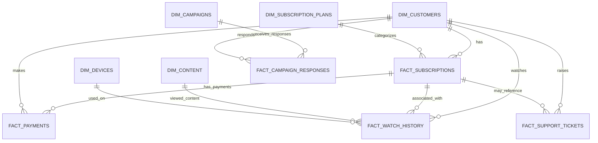

# StreamFlow Platform Analytics — Data Dictionary

## 1. Purpose

This document describes the CSV datasets used in the StreamFlow Platform Analytics project. It explains each table's business purpose, row-level grain, fields, likely key relationships, and interpretation notes to help analysts write consistent SQL and build dashboards.

> **Project context:** StreamFlow is a fictional subscription-based video-streaming service. The datasets are synthetic and are intended for portfolio and analytical demonstration purposes; they are not production customer records.

## 2. Dataset Inventory

The following inventory reflects the CSV files reviewed for this project. Row counts are based on the files available during documentation and may change if the data is regenerated.

| File | Table role | Approximate rows | Description |
|---|---|---:|---|
| `dim_customers.csv` | Dimension | 10,000 | Customer profile, location, acquisition, and account attributes |
| `dim_subscription_plans.csv` | Dimension | 6 | Subscription plan features and listed pricing |
| `dim_content.csv` | Dimension | 2,000 | Movie and series metadata |
| `dim_devices.csv` | Dimension | 10 | Device and operating-system metadata |
| `dim_campaigns.csv` | Dimension | 20 | Marketing campaign details, dates, budget, and target region |
| `fact_subscriptions.csv` | Fact | 10,000 | Subscription records and lifecycle attributes |
| `fact_payments.csv` | Fact | 112,228 | Payment transactions and payment outcomes |
| `fact_watch_history.csv` | Fact | 298,706 | Content viewing activity and engagement attributes |
| `fact_campaign_responses.csv` | Fact | 49,533 | Customer campaign responses, conversions, cost, and attributed revenue |
| `fact_support_tickets.csv` | Fact | 8,815 | Customer support tickets, resolution, satisfaction, and escalation attributes |

## 3. Table Relationships

The following relationships are suggested by the identifiers in the datasets. Confirm them against the actual database or BigQuery schema before treating them as enforced foreign-key constraints.

### Relationship notes

- `customer_id` connects customer records to subscriptions, payments, viewing activity, campaign responses, and support tickets.
- `plan_id` connects subscriptions to `dim_subscription_plans.csv`.
- `subscription_id` connects payment and viewing records to subscription records; support tickets may also reference a subscription.
- `content_id` and `device_id` connect viewing activity to content and device dimensions.
- `campaign_id` connects campaign responses to campaign details.
- The CSV files do not include a separate date dimension. Date-based reporting can use the date fields directly or a calendar table created in the warehouse.
- The CSVs themselves do not enforce primary-key or foreign-key constraints. Validate uniqueness and referential integrity after loading.

---

## 4. Dimension Tables

## 4.1 `dim_customers.csv`

**Purpose:** Stores customer profile and account attributes for demographic, geographic, acquisition, and customer-segmentation analysis.

**Grain:** One row per `customer_id` (expected; validate uniqueness).

| Column | Meaning | Expected data type | Notes |
|---|---|---|---|
| `customer_id` | Unique customer identifier | Integer / string ID | Candidate primary key |
| `first_name` | Customer first name | String | Synthetic personal attribute |
| `last_name` | Customer last name | String | Synthetic personal attribute |
| `email` | Customer email address | String | Synthetic; avoid exposing unnecessarily in public outputs |
| `gender` | Recorded gender category | String | Category values should be checked for consistency |
| `date_of_birth` | Customer date of birth | Date | Can be used to derive age; age depends on the reporting date |
| `city` | Customer city | String | Geographic segmentation |
| `state` | Customer state or region | String | Geographic segmentation |
| `country` | Customer country | String | Geographic segmentation |
| `occupation` | Customer occupation category | String | Customer profile attribute |
| `income_band` | Customer income grouping | String | Categorical, not an exact income amount |
| `signup_date` | Date customer registered | Date | Can support acquisition and customer-growth trends |
| `acquisition_channel` | Channel associated with customer acquisition | String | Channel naming should be standardized across tables |
| `email_verified` | Whether the email is marked as verified | Boolean | CSV values may be text such as `True` / `False` |
| `account_status` | Current or recorded account status | String | Confirm status definitions before calculating active-customer metrics |

**Common uses:** Customer counts, demographic breakdowns, geographic distribution, acquisition-channel analysis, and customer segmentation.

## 4.2 `dim_subscription_plans.csv`

**Purpose:** Describes available subscription plans, their pricing, billing cycle, and feature entitlements.

**Grain:** One row per `plan_id` (expected; validate uniqueness).

| Column | Meaning | Expected data type | Notes |
|---|---|---|---|
| `plan_id` | Unique subscription plan identifier | Integer / string ID | Candidate primary key |
| `plan_name` | Display name of the plan | String | Use for dashboard labels |
| `billing_cycle` | Billing frequency associated with the plan | String | Examples may include monthly or annual billing |
| `monthly_price` | Listed monthly price for the plan | Decimal | Confirm currency and whether annual plans are represented as monthly-equivalent prices |
| `max_devices` | Maximum number of supported devices | Integer | Plan feature attribute |
| `video_quality` | Maximum or advertised video quality | String | Category, such as HD or 4K |
| `ads_enabled` | Whether advertisements are enabled | Boolean | CSV values may be text such as `True` / `False` |
| `offline_download` | Whether offline downloads are available | Boolean | CSV values may be text such as `True` / `False` |
| `plan_status` | Plan availability or status | String | Confirm whether inactive plans remain in historical subscription records |

**Common uses:** Subscription-plan distribution, plan feature comparisons, and plan-level revenue context. For actual collected revenue, use payment records rather than multiplying the current plan price by customer counts unless that method is explicitly intended.

## 4.3 `dim_content.csv`

**Purpose:** Stores metadata about the content available on StreamFlow, supporting title, type, genre, language, rating, and popularity analysis.

**Grain:** One row per `content_id` (expected; validate uniqueness).

| Column | Meaning | Expected data type | Notes |
|---|---|---|---|
| `content_id` | Unique content identifier | Integer / string ID | Candidate primary key |
| `title` | Content title | String | Display label; titles may not be unique |
| `content_type` | Type of content | String | For example, movie or series; confirm actual category values |
| `genre` | Assigned genre | String | A single field may contain one or more genre labels depending on the data design |
| `language` | Primary language of the content | String | Category values should be standardized |
| `release_year` | Year the content was released | Integer | Check for missing or implausible years |
| `duration_minutes` | Content duration in minutes | Integer / decimal | Confirm how duration is represented for series or episodic content |
| `imdb_rating` | Rating value associated with the content | Decimal | Synthetic field; do not imply a live IMDb connection |
| `age_rating` | Age classification | String | Rating system and category definitions should be documented if used in reporting |
| `exclusive_content` | Whether the content is marked as exclusive | Boolean | CSV values may be text such as `True` / `False` |
| `popularity_score` | Assigned popularity score | Decimal | Interpret according to the synthetic dataset's scoring design; not necessarily a standardized external metric |

**Common uses:** Most-watched titles, genre analysis, content-type comparisons, engagement by language, and comparisons between popularity scores and observed viewing activity.

## 4.4 `dim_devices.csv`

**Purpose:** Provides device metadata for analyzing viewing activity by device, operating system, and device category.

**Grain:** One row per `device_id` (expected; validate uniqueness).

| Column | Meaning | Expected data type | Notes |
|---|---|---|---|
| `device_id` | Unique device identifier | Integer / string ID | Candidate primary key |
| `device_name` | Device name or model category | String | Display label |
| `operating_system` | Operating system associated with the device | String | Category values should be standardized |
| `device_category` | Broad device grouping | String | For example, mobile, television, tablet, or desktop; use observed values |

**Common uses:** Viewing sessions, watch time, and engagement by device category or operating system.

## 4.5 `dim_campaigns.csv`

**Purpose:** Stores marketing campaign metadata, including campaign type, active dates, planned budget, and target region.

**Grain:** One row per `campaign_id` (expected; validate uniqueness).

| Column | Meaning | Expected data type | Notes |
|---|---|---|---|
| `campaign_id` | Unique campaign identifier | Integer / string ID | Candidate primary key |
| `campaign_name` | Campaign name | String | Display label |
| `campaign_type` | Campaign channel or type | String | Confirm the meaning of this field from the generation logic |
| `start_date` | Campaign start date | Date | Used to define campaign period |
| `end_date` | Campaign end date | Date | Validate that the end date is not before the start date |
| `budget` | Planned campaign budget | Decimal | Confirm currency and whether this is planned budget or actual expenditure |
| `target_region` | Geographic region targeted by the campaign | String | May be compared with customer location, but definitions may differ |

**Common uses:** Campaign inventory, budget comparisons, campaign-period reporting, and campaign performance by type or target region.

---

## 5. Fact Tables

## 5.1 `fact_subscriptions.csv`

**Purpose:** Records subscription lifecycle and plan assignment information.

**Grain:** One row per `subscription_id` (expected; validate uniqueness).

| Column | Meaning | Expected data type | Notes |
|---|---|---|---|
| `subscription_id` | Unique subscription identifier | Integer / string ID | Candidate primary key |
| `customer_id` | Customer associated with the subscription | Integer / string ID | Links to `dim_customers.customer_id` |
| `plan_id` | Plan associated with the subscription | Integer / string ID | Links to `dim_subscription_plans.plan_id` |
| `subscription_start_date` | Date the subscription started | Date | Supports subscription cohort and start-date analysis |
| `renewal_date` | Recorded renewal date | Date | Interpret with billing cycle and subscription status |
| `billing_cycle` | Billing frequency recorded for this subscription | String | May be useful for historical subscription analysis |
| `auto_renewal` | Whether automatic renewal is enabled | Boolean | Not necessarily evidence that a renewal payment succeeded |
| `subscription_status` | Recorded subscription status | String | Define which values count as active, cancelled, expired, or other statuses |
| `churn_flag` | Whether the record is marked as churned | Boolean | Use the dataset's defined flag; validate against status and churn date |
| `churn_date` | Recorded churn date | Date / nullable | Blank values may represent no recorded churn date |
| `tenure_months` | Recorded subscription tenure in months | Integer / decimal | Validate calculation rules and reference date before interpreting as current tenure |

**Common uses:** Subscription status, plan mix, renewal behavior, churn analysis, and tenure analysis.

**Interpretation note:** Customer churn and subscription churn are not always the same. If customers can hold multiple subscriptions, define the entity and denominator used for churn metrics.

## 5.2 `fact_payments.csv`

**Purpose:** Records payment transactions, amounts, payment dates, methods, currencies, and outcomes.

**Grain:** One row per `payment_id` (expected; validate uniqueness).

| Column | Meaning | Expected data type | Notes |
|---|---|---|---|
| `payment_id` | Unique payment transaction identifier | Integer / string ID | Candidate primary key |
| `subscription_id` | Subscription associated with the payment | Integer / string ID | Links to `fact_subscriptions.subscription_id` where populated and valid |
| `customer_id` | Customer associated with the payment | Integer / string ID | Links to `dim_customers.customer_id` |
| `payment_date` | Date of the payment transaction | Date | Can be used for monthly and daily payment trends |
| `amount` | Transaction amount | Decimal | Use with `currency`; do not aggregate across currencies without a conversion policy |
| `currency` | Currency code or label for the amount | String | Confirm supported currency values and standardize codes |
| `payment_method` | Method used for the payment | String | For example, card or another payment method; use observed values |
| `payment_status` | Outcome or status of the payment | String | Define successful statuses before calculating collected revenue |
| `transaction_reference` | Transaction reference identifier | String | Treat as transaction metadata; avoid exposing unnecessarily |

**Common uses:** Successful-payment revenue, payment success rate, revenue by plan/customer/region/payment method, average payment amount, and monthly payment trends.

**Important revenue notes:**

- Filter to the appropriate successful payment statuses when calculating collected revenue.
- Check for refunds, reversals, duplicate transactions, and failed attempts if those cases exist in the data.
- Since the dataset includes a `currency` field, amounts should not be combined across currencies unless a documented conversion method is applied.
- Payment revenue is not automatically equivalent to recognized revenue, Monthly Recurring Revenue (MRR), or Annual Recurring Revenue (ARR). MRR and ARR require a clearly defined recurring-revenue methodology.

## 5.3 `fact_watch_history.csv`

**Purpose:** Records viewing activity, including content watched, viewing duration, completion, device, quality, downloads, and engagement segment.

**Grain:** One row per `watch_id` viewing record (expected; validate uniqueness). A row should not automatically be assumed to represent a unique customer session unless that is how the data was generated.

| Column | Meaning | Expected data type | Notes |
|---|---|---|---|
| `watch_id` | Unique viewing record identifier | Integer / string ID | Candidate primary key |
| `customer_id` | Customer associated with the viewing record | Integer / string ID | Links to `dim_customers.customer_id` |
| `subscription_id` | Subscription associated with the viewing record | Integer / string ID | Links to `fact_subscriptions.subscription_id` where valid |
| `content_id` | Content viewed | Integer / string ID | Links to `dim_content.content_id` |
| `device_id` | Device used for viewing | Integer / string ID | Links to `dim_devices.device_id` |
| `watch_date` | Date of viewing activity | Date | Supports daily and monthly engagement trends |
| `watch_start_time` | Start time of the viewing record | Time | Supports time-of-day analysis |
| `watch_duration_minutes` | Duration watched in minutes | Integer / decimal | Summing this field gives recorded watch minutes; convert to hours by dividing by 60 |
| `completion_percentage` | Percentage of content completed | Decimal | Confirm expected range, usually 0–100, and whether values are capped |
| `watch_quality` | Recorded playback quality | String | Category such as HD or 4K, based on observed values |
| `is_downloaded` | Whether the viewing record is marked as downloaded | Boolean | Clarify whether this means offline playback or content download activity |
| `binge_session` | Whether the record is marked as part of a binge session | Boolean | Definition depends on the synthetic data-generation rules |
| `engagement_segment` | Assigned engagement grouping | String | Treat as a preassigned segment unless its derivation is documented |

**Common uses:** Total watch minutes/hours, viewing-record counts, top titles, genre engagement, completion analysis, device usage, viewing time-of-day, and engagement segmentation.

**Interpretation note:** Watch time and viewing-record counts measure activity, not necessarily unique sessions or unique viewers. Use distinct customer and content identifiers when the business question requires unique counts.

## 5.4 `fact_campaign_responses.csv`

**Purpose:** Records campaign response events and their conversion, cost, and revenue attributes.

**Grain:** One row per `response_id` campaign-response record (expected; validate uniqueness). A customer may appear in multiple response records.

| Column | Meaning | Expected data type | Notes |
|---|---|---|---|
| `response_id` | Unique campaign-response identifier | Integer / string ID | Candidate primary key |
| `campaign_id` | Campaign associated with the response | Integer / string ID | Links to `dim_campaigns.campaign_id` |
| `customer_id` | Customer associated with the response | Integer / string ID | Links to `dim_customers.customer_id` |
| `campaign_date` | Date of the campaign response or activity | Date | Confirm exact event meaning from the data-generation process |
| `response_type` | Type of response or interaction | String | For example, click or another response category; use observed values |
| `converted` | Whether the response is marked as converted | Boolean | Define conversion rate denominator consistently |
| `conversion_date` | Date conversion was recorded | Date / nullable | Blank values may indicate no recorded conversion |
| `acquisition_channel` | Channel attributed to the response or acquisition | String | May differ from the customer's original acquisition channel |
| `campaign_cost` | Cost attributed to this response record | Decimal | Confirm whether it is event-level cost, allocated spend, or another cost measure |
| `campaign_revenue` | Revenue attributed to this response record | Decimal | Confirm attribution window and currency before using in ROI/ROAS |

**Common uses:** Response volume, conversion counts/rates, campaign-level attributed revenue, campaign cost, cost per acquisition, return on ad spend, and campaign comparisons.

**Important marketing notes:**

- Document the conversion-rate denominator (all response records, clicks, or another eligible population).
- Avoid assuming `campaign_cost` is the same as the campaign's total planned `budget`.
- ROI and ROAS are different metrics. Define the formula and ensure costs and revenue use compatible units and attribution rules.
- Handle zero-cost records explicitly when calculating ratios.
- A customer can have multiple campaign responses, so response counts are not necessarily unique-customer counts.

## 5.5 `fact_support_tickets.csv`

**Purpose:** Records customer support cases and their operational outcomes, including issue type, priority, resolution time, satisfaction, escalation, and first-contact resolution.

**Grain:** One row per `ticket_id` support ticket (expected; validate uniqueness).

| Column | Meaning | Expected data type | Notes |
|---|---|---|---|
| `ticket_id` | Unique support ticket identifier | Integer / string ID | Candidate primary key |
| `customer_id` | Customer who raised the ticket | Integer / string ID | Links to `dim_customers.customer_id` |
| `subscription_id` | Subscription associated with the ticket, if applicable | Integer / string ID / nullable | Validate that values match subscription records; the column may be populated only when a subscription is associated |
| `ticket_created_date` | Date the ticket was created | Date | Supports ticket-volume trends |
| `issue_category` | Category of the reported issue | String | Standardize categories before comparing volumes |
| `priority` | Ticket priority | String | Confirm the priority scale and category definitions |
| `ticket_status` | Current or recorded ticket status | String | Define which statuses count as open, resolved, or closed |
| `resolution_time_hours` | Recorded time to resolve the ticket, in hours | Decimal / integer | Check whether unresolved tickets are null, excluded, or represented another way |
| `assigned_team` | Team assigned to the ticket | String | Team-level workload analysis |
| `customer_satisfaction` | Satisfaction score associated with the ticket | Integer / decimal | Confirm score scale and missing-value treatment before calculating average CSAT |
| `ticket_channel` | Channel through which the ticket was submitted | String | For example, email or another support channel; use observed values |
| `escalation_flag` | Whether the ticket is marked as escalated | Boolean | Define denominator for escalation rate |
| `first_contact_resolution` | Whether the issue was resolved on first contact | Boolean | Define eligible ticket population for FCR calculations |

**Common uses:** Ticket volume, issue mix, resolution time, ticket status, team workload, customer satisfaction, escalation rate, and first-contact resolution rate.

**Interpretation note:** Average resolution time should generally be calculated on tickets with valid resolution-time values. CSAT, escalation, and first-contact resolution metrics need clearly defined eligible populations and treatment of missing values.

---

## 6. Key Metrics and Suggested Definitions

These are suggested reporting definitions. Match them to the SQL implementation and business requirements before publishing dashboard results.

| Metric | Suggested definition | Main source | Caution |
|---|---|---|---|
| Total customers | Count of distinct `customer_id` | `dim_customers` | Do not count joined rows after one-to-many joins |
| Active customers | Distinct customers meeting the agreed account/subscription activity rule | Customers and/or subscriptions | `account_status` and `subscription_status` may represent different concepts |
| Subscription count | Count of distinct `subscription_id` | `fact_subscriptions` | One customer may have multiple subscription records depending on the model |
| Churned subscriptions | Count of subscriptions where `churn_flag` meets the agreed churn definition | `fact_subscriptions` | Validate against `subscription_status` and `churn_date` |
| Collected payment revenue | Sum of `amount` for eligible successful payments | `fact_payments` | Do not combine currencies without conversion |
| Average payment amount | Average `amount` for eligible payment records | `fact_payments` | Decide whether failed payments are excluded |
| Watch hours | Sum of `watch_duration_minutes` divided by 60 | `fact_watch_history` | Reflects recorded watch duration, not necessarily unique session time |
| Viewing records | Count of distinct `watch_id` | `fact_watch_history` | Do not label as unique sessions unless the data model supports that interpretation |
| Conversion rate | Eligible converted response records divided by eligible response records | `fact_campaign_responses` | State the denominator and attribution rules |
| Cost per acquisition (CPA) | Eligible campaign cost divided by attributed conversions | Campaign responses / campaign cost data | Ensure cost and conversion scope align; handle zero conversions |
| Return on ad spend (ROAS) | Attributed campaign revenue divided by eligible advertising cost | `fact_campaign_responses` | Not the same as ROI; confirm currency and attribution window |
| Average resolution time | Average valid `resolution_time_hours` for the selected ticket population | `fact_support_tickets` | Specify whether only resolved tickets are included |
| Average customer satisfaction | Average valid `customer_satisfaction` scores | `fact_support_tickets` | Confirm score scale and missing values |
| Escalation rate | Eligible escalated tickets divided by eligible tickets | `fact_support_tickets` | Define the ticket population and status handling |
| First-contact resolution rate | Eligible tickets marked as first-contact resolved divided by eligible tickets | `fact_support_tickets` | Define eligibility and treatment of missing flags |

### Revenue metric distinction

- **Payment revenue** is derived from payment transactions that meet the chosen payment-status rules.
- **MRR** generally represents the normalized monthly value of active recurring subscriptions under a defined methodology. It should not automatically be calculated as all payments received during a month.
- **ARR** generally represents annualized recurring revenue under a defined methodology. It should not automatically be calculated as total monthly payment revenue multiplied by 12.
- **Revenue contribution by plan** is a plan's share of total revenue for the selected period: plan revenue divided by total revenue for the same period and currency basis.

---

## 7. Data Quality and Validation Checklist

Run these checks after loading the CSVs into MySQL or BigQuery and whenever the datasets are regenerated.

- [ ] Confirm each candidate primary key is unique and non-null.
- [ ] Validate that foreign-key-like identifiers map to valid records in the related table.
- [ ] Check date columns parse correctly and that campaign end dates do not precede start dates.
- [ ] Check numeric fields for invalid values, unexpected negatives, and out-of-range values.
- [ ] Confirm boolean fields are consistently represented and converted to Boolean types.
- [ ] Standardize category values such as status, payment method, device category, and acquisition channel.
- [ ] Identify blank or null values in `conversion_date`, `churn_date`, `resolution_time_hours`, and `customer_satisfaction`.
- [ ] Check whether `fact_payments.amount` includes multiple currencies before aggregating revenue.
- [ ] Check whether campaign costs and revenue are event-level, campaign-level, or allocated amounts before calculating ROI/ROAS.
- [ ] Reconcile dashboard KPIs to a clearly defined SQL query and reporting period.

## 8. Naming and Implementation Notes

- File names use a `dim_` prefix for descriptive tables and a `fact_` prefix for activity or transaction tables.
- Column names in this document reflect the CSV headers reviewed. Database or BigQuery table names may differ depending on the loading process.
- Expected data types are inferred from the field names and sample CSV values. Verify actual types in the destination database schema before relying on these assumptions.
- This document describes the available columns and their intended analytical interpretation; it does not guarantee that every identifier relationship is enforced or that every business rule is encoded in the data.
- Keep this dictionary synchronized with changes to the CSV headers, SQL queries, warehouse schema, and dashboard calculations.
